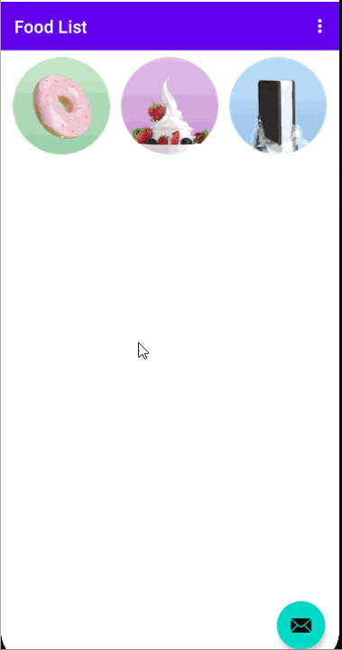

## Answer these questions
## Question 1
### Which template provides an Activity with an options menu and the v7 appcompat support library Toolbar as the app bar? Choose one:
Empty Activity template  
Basic Activity template  
Navigation Drawer Activity template  
Bottom Navigation Activity  
<b>Ans: Basic Activity template </b>  
## Question 2
### Which dependency do you need in order to use a TabLayout? Choose one:
com.android.support:design  
com.android.support.constraint:constraint-layout  
junit:junit:4.12  
com.android.support.test:runner  
<b>Ans: com.android.support:design </b>  
## Question 3
### Where do you define each child Activity and parent Activity to provide Up navigation? Choose one:
To provide the Up button for a child screen Activity, declare the parent Activity in the child Activity section of the activity_main.xml file.  
To provide the Up button for a child screen Activity, declare the parent Activity in the "main" XML layout file for the child screen Activity.  
To provide the Up button for a child screen Activity, declare the parent Activity in the child Activity section of the AndroidManifest.xml file.  
To provide the Up button for a child screen Activity, declare the parent Activity in the parent Activity section of the AndroidManifest.xml file.  
<b>Ans: To provide the Up button for a child screen Activity, declare the parent Activity in the child Activity section of the AndroidManifest.xml file. </b>  
 
